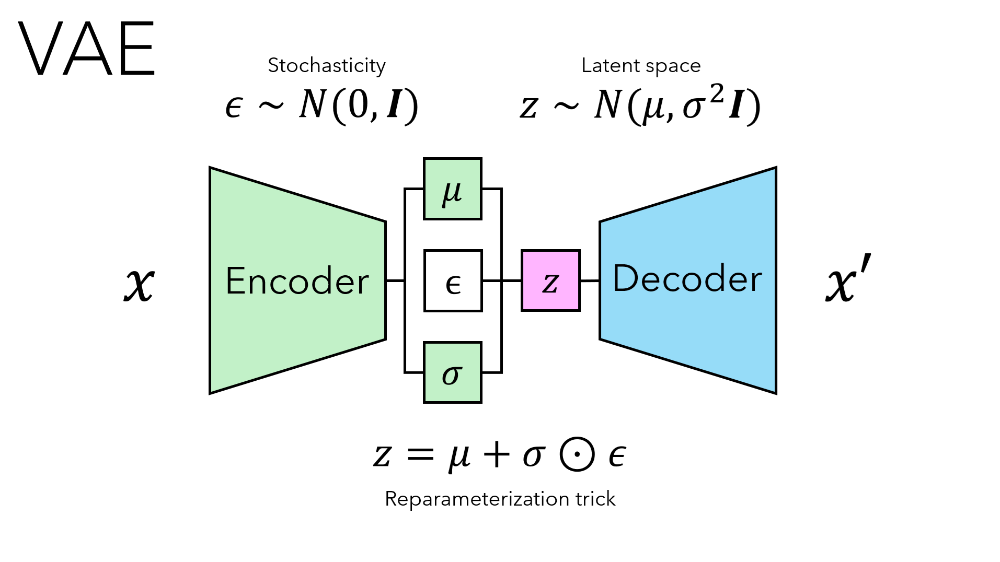

# Variational Autoencoders (VAEs)

The following write-up is primarily for my own personal reference, to revist in the future as needed.

## Foundation

Variational Autoencoders (VAEs) [Kingma & Welling, 2013] were among the earliest deep learning-based generative models alongside generative adversarial networks (GANs) [Goodfellow, 2014]. Similar to other AEs used in data compression and image denoising, VAEs learn a mapping from input data samples $x\in X$ to a vector $z$ in lower-dimensional space which is used to generate output $x'$. Most AEs are trained to minimize a reconstruction loss and do not enforce any explicit structure of the latent space. Due to this lack of structure, even small variations on $z$ in the latent space do not produce meaningful decodings representative of the original input $x$. VAEs on the otherhand produce a well-structured, smooth, probabilistic latent space. The structure of this space ensures that small variations of $z$ result in gradual and meaningful changes in the generated outputs $x'$.

Given some true distribution of data $p(x)$, where $x\in \mathcal{X}$, a VAE approximates this distribution with a model $p_\theta(x) \approx p(x)$ parametrized by $\theta$. For example, if our data consists primarily of images of faces, then a well-trained VAE, the maximum likelihood estimator, assigns high probability density to images similar to faces and lower density to out-of-distribution samples. Instead of directly modeling $p_\theta(x)$, VAEs introduce a latent variable $z$ in an auxiliary space $\mathcal{Z}$, which is sampled from a simple prior distribution $p(z)$, and generate $x$ using a sufficiently expressive model of the conditonal distribution $p_\theta(x|z)$ (i.e., the decoder). The marginal likelihood $p_\theta(x)$ can now be expressed as,

$$ p_\theta(x) = \int p_\theta(x,z)dz $$

$$ p_\theta(x) = \int p_\theta(x|z)p(z)dz .$$

Generating latent variables $z\in\mathcal{Z}$ requires a mapping from the data space to the latent space using the conditional distribution $p(z|x)$. This distribution, also called the posterior distribution, is not known and must be approximated also using a sufficiently expressive model $q_\phi(z|x) \approx p(z|x)$ with parameters $\phi$ (i.e., the encoder). This approximate posterior can be introduced into the previous equation as,

$$ p_\theta(x) = \int \frac{q_\phi(z|x)}{q_\phi(z|x)}p_\theta(x|z)p(z)dz \quad\leftarrow\text{multiply by 1}$$

and through the definition of the expectation we get,

$$ p_\theta(x) = E_{q_\phi(z|x)} \left[\frac{p_\theta(x|z)p(z)}{q_\phi(z|x)}\right] $$

taking the log of our likelihood, our equation becomes,

$$ \log\ p_\theta(x) = E_{q_\phi(z|x)} \left[ \log\ p_\theta(x|z)) + \log\ \frac{p(z)}{q_\phi(z|x)}\right] $$

$$ \log\ p_\theta(x) = E_{q_\phi(z|x)}[\log\ p_\theta(x|z)] - D_{KL}\left(q_\phi(z|x) \parallel p(z)\right)$$

where the first term represents the quality of our reconstruction, which we want to maximize and the second term acts as a regularization term, with $D_{KL}$ indicating the Kullback-Leibler divergence, a measure of how much the probability distribution $q_\phi(z|x)$ is different from our assumed true prior distribution $p(z)$, something we want to minimize. It is ultimately the regularization term which enforces a smooth, well-defined structure of the VAE latent space.

## Practical Application

<p align="center">
  
</p>

In practice, the encoder $q_\phi(z|x)$, is neural network trained to produce latent vectors $z$ in an uncorrelated multivariate Gaussian space, $z \sim \mathcal{N}(\mu,\text{diag}(\sigma^2))$. This is done by learning vectors $\mu$ and $\log(\sigma^2)$. Typically, the output of the encoder is flattened and passed to two separate fully-connected layers, one each for $\mu$ and \$\sigma$, and no activation is applied. Note that $\log(\sigma^2)$ is typically learned instead of $\sigma$ directly to allow for negative values. We sample $z$ from this space using stochastic vector $\epsilon \sim \mathcal{N}(0,I)$. This separate vector moves the stochasticity outside of the VAE model parameters and allows for backpropagation. Also called the reparametrization trick, sampling of $z$ is done by sampling $\epsilon$ and scaling and shifting the vector by our learned $\sigma$ and $\mu$ respectively, as $z = \mu + \sigma\odot\epsilon$. The newly sampled latent space vector $z$, is then passed to a decoder neural netwrk to produce $x'$. The typical loss function used is,

$$L=\text{MSE}(x,x') - \frac{1}{2}\sum \left(1 + \log(\sigma^2) - \mu^2 -\sigma^2\right)$$

where the first term on the RHS represents the reconstruction loss and the second term on the RHS is the analytical solution to $D_{KL}$ for two multivariate Gaussian distributions.

## MNIST Demo

A very simple VAE was constructed and trained on images of the MNIST dataset. See architecture below.

```
VAE(
  (Encoder): Sequential(
    (0): Conv2d(1, 32, kernel_size=(3, 3), stride=(2, 2), padding=(1, 1))
    (1): ReLU()
    (2): Conv2d(32, 64, kernel_size=(3, 3), stride=(2, 2), padding=(1, 1))
    (3): ReLU()
    (4): Flatten(start_dim=1, end_dim=-1)
  )
  (FC_mu): Linear(in_features=3136, out_features=10, bias=True)
  (FC_logvar): Linear(in_features=3136, out_features=10, bias=True)
  (Decoder): Sequential(
    (0): Linear(in_features=10, out_features=3136, bias=True)
    (1): Unflatten(dim=1, unflattened_size=(64, 7, 7))
    (2): ReLU()
    (3): ConvTranspose2d(64, 64, kernel_size=(3, 3), stride=(2, 2), padding=(1, 1), output_padding=(1, 1))
    (4): ReLU()
    (5): ConvTranspose2d(64, 32, kernel_size=(3, 3), stride=(2, 2), padding=(1, 1), output_padding=(1, 1))
    (6): ReLU()
    (7): ConvTranspose2d(32, 1, kernel_size=(3, 3), stride=(1, 1), padding=(1, 1))
    (8): Sigmoid()
  )
)
```

After training, test images were encoded, and for each digit, a representative latent space vector was computed as the mean of its corresponding encoded representations. Linear interpolation was then performed between the latent vectors of digits [9, 4, 2, 6, 1], and the resulting decoded images are shown below. Generating meaningful latent space interpolations highlights the true value of VAEs, as a well-structured latent space enables further exploration and optimization (e.g., novel chemical design). While several other interpolation methods exist, their effectiveness is domain-dependent. That said, one can easily appreciate how the choice of an $n$-dimensional trajectory could significantly impact the semantic continuity between two latent vectors. 

<p align="center">
  
</p>

